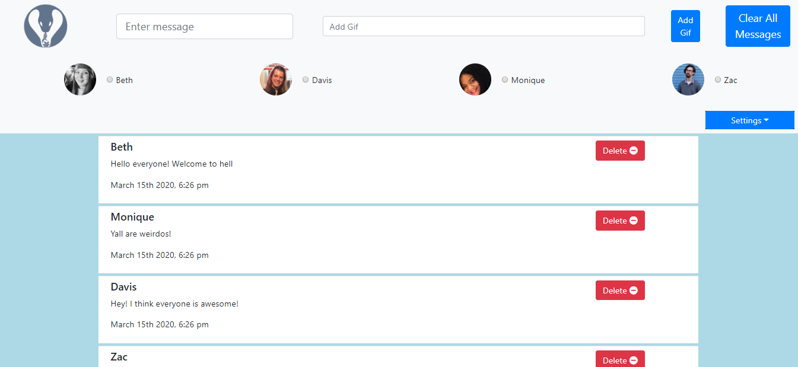
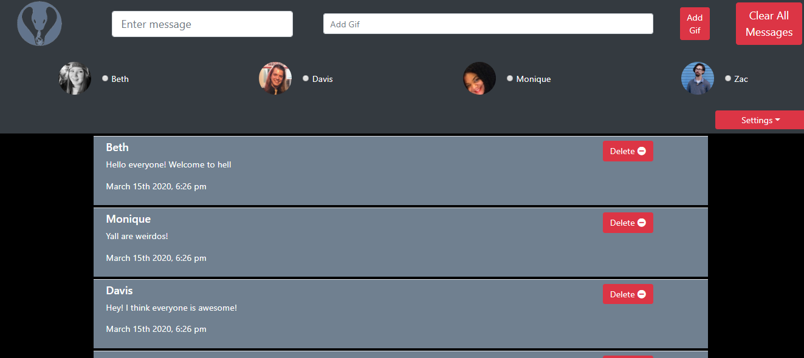
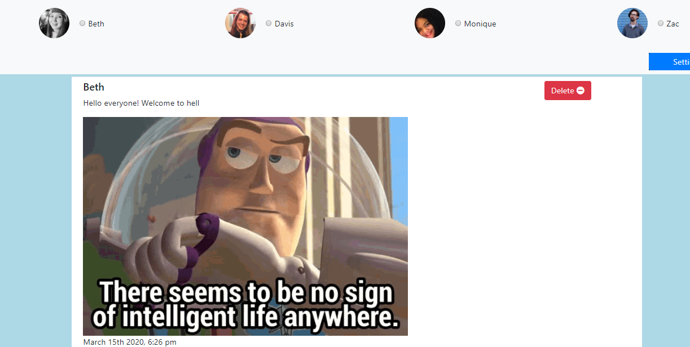

# chatty-cobralily
chatty-cobralily created by GitHub Classroom

## Description
In this second group project we created a messaging app where users can add and delete messages. The user also has the ability to toggle between not only a normal theme, but a dark theme as well. Along that same line, a user can toggle between larger and smaller text to ease reading on the eyes. The user also has the ability to enter in a Gif search and post a Gif to the page as well.

This project explored our knowledge of using ES6 modules, getter and setter methods, JQuery methods, and SASS, along with everything else we have learned in class up to this point.

## Technologies Used
* HTML 5
* CSS3
* SCSS
* Javascript

## How to run
1. Clone down this repo

1. Make sure you have http-server installed via npm. If not get it [HERE](https://www.npmjs.com/package/http-server).

1. In your command line run hs `-p 9999`

1. In your browser go to to `http://localhost:9999`

## ScreenShot

## Creators
[Davis Lindell](https://github.com/delindell)
[Beth Nielsen](https://github.com/bethh56)
[Monique Bass](https://github.com/Nikababy01)
[Zac Crumpton](https://github.com/ZacCrumpton)
